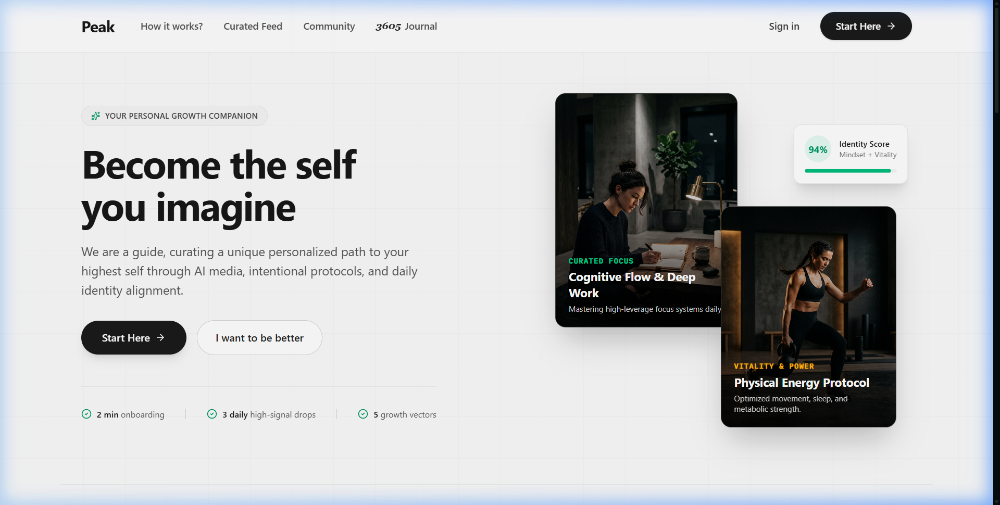
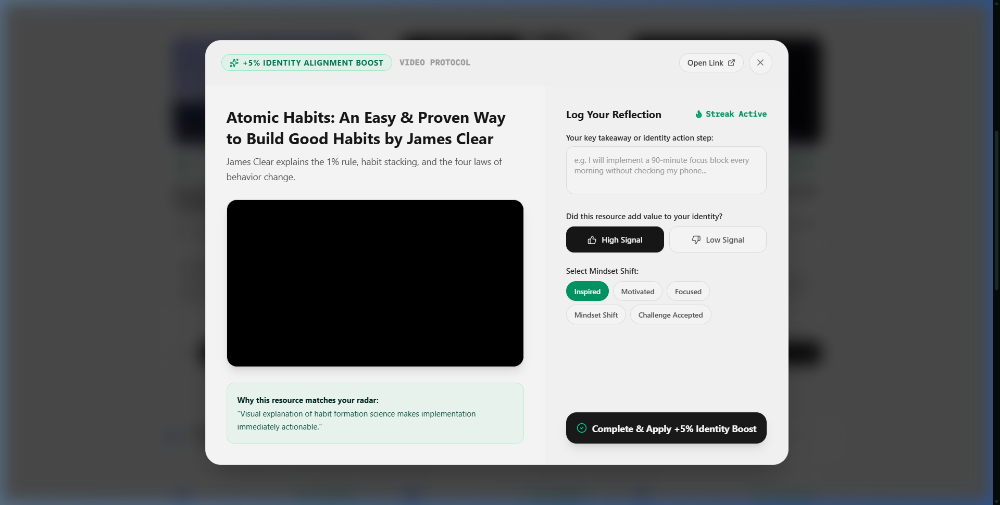
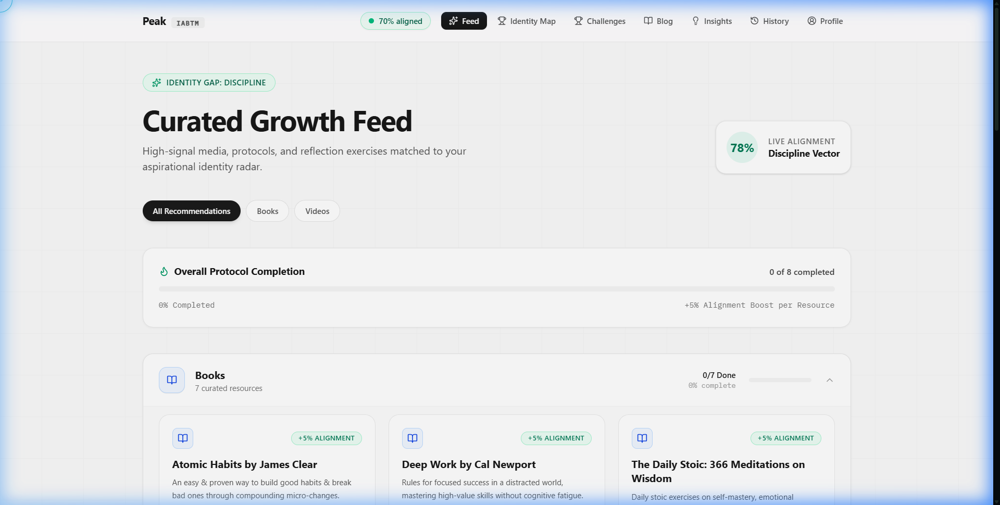
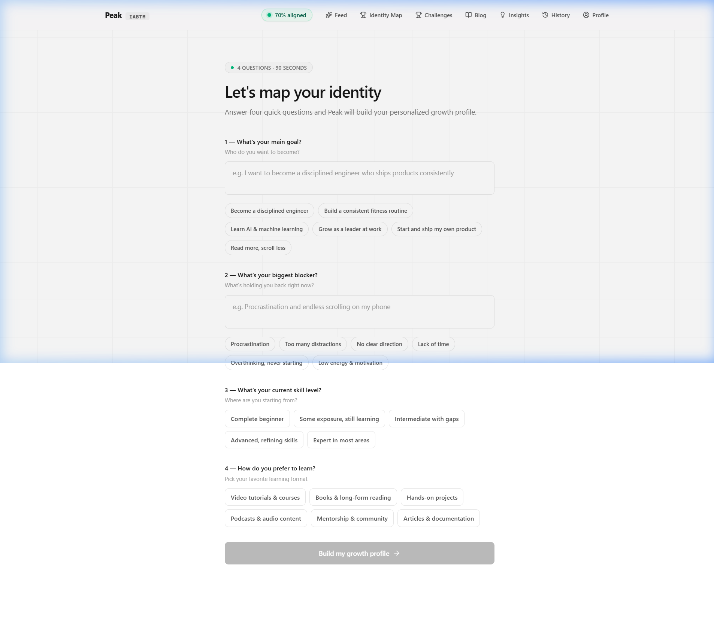

# ⛰️ Peak — Evolve Your Potential

> **Break the Attention Trap. Become the Self You Imagine.**

**Peak** is an agentic AI-powered personal growth engine designed to replace mindless doomscrolling with deeply intentional identity transformation. By mapping your aspirational self and analyzing behavioral gaps, Peak delivers a daily feed of high-signal resources, interactive protocols, and real-time radar alignment tracking.

[](https://curator-ai.vercel.app)
[](https://github.com/yug0973/curator-ai)
[](LICENSE)

---

## 📸 Visual Tour

### 1. High-Contrast Hero & Interactive Protocol Stack
Experience Peak’s minimalist aesthetic with dark-pill action buttons, live identity alignment badges, and floating visual cards.



---

### 2. Interactive Media Player & Live Reflection Modal
Consume videos, audio podcasts, and book summaries directly inside Peak with built-in reflection logging and real-time identity radar boosts (+5%).



---

### 3. Curated Growth Feed & Protocol Filter Tabs
Filter high-signal recommendations by category (**All**, **Videos**, **Books**, **Podcasts**, **Articles**, **Courses**), complete with active protocol progress trackers.



---

### 4. Conversational 4-Question Identity Onboarding
Define your target goals, daily habits, friction points, and identity gaps through a guided conversational flow.



---

## ✨ Core Features

* 🧭 **Identity Gap Analysis**: Maps your aspirational traits vs. current behaviors across 5 key dimensions: **Health**, **Learning**, **Discipline**, **Confidence**, and **Leadership**.
* 📺 **Interactive Media Player**: Embedded YouTube player, audio podcast player with animated equalizer bars, and reader view with live reflection note logging.
* ⚡ **Daily +5% Alignment Boosts**: Complete curated protocols and log reflections to update your live identity alignment score in real time.
* 🏆 **Growth Challenges**: Structured 14-to-30 day daily habit challenges tailored to your widest identity gap.
* 📖 **3605 Reflection Journal**: Daily micro-journaling prompts for long-term consistency.

---

## 🛠️ Tech Stack

* **Frontend**: React 19, TypeScript, Vite, Tailwind CSS v4, Framer Motion, Recharts, Lucide React
* **Backend**: Node.js, Express, TypeScript (`tsx`)
* **AI & Data**: Google Gemini AI API, YouTube Data API
* **Styling & Effects**: Glassmorphism, Tailwind custom utilities, Framer Motion interactive cards

---

## 🚀 Quick Start

### Prerequisites
- **Node.js**: v18+ 
- **npm** or **bun**

### Installation

1. **Clone the repository**
   ```bash
   git clone https://github.com/yug0973/curator-ai.git
   cd curator-ai
   ```

2. **Install dependencies**
   ```bash
   npm install
   ```

3. **Configure Environment Variables**
   Create a `.env` file in the root directory:
   ```env
   PORT=3000
   GEMINI_API_KEY=your_gemini_api_key_here
   REACT_APP_YOUTUBE_API_KEY=your_youtube_api_key_here
   ```

4. **Launch Development Server**
   ```bash
   npm run dev
   ```
   Open [http://localhost:3000](http://localhost:3000) in your browser.

---

## 📂 Project Architecture

```
curator-ai/
├── docs/
│   └── images/                       # Screenshots for README
├── public/                           # Hero card assets & static media
├── src/
│   ├── components/
│   │   ├── Header.tsx                # Glassmorphic top navigation
│   │   ├── MediaPlayerModal.tsx      # Video/Audio reader player modal
│   │   ├── RadarChartComponent.tsx   # Recharts radar data visualization
│   │   └── ...
│   ├── pages/
│   │   ├── LandingPage.tsx           # High-contrast Peak hero landing page
│   │   ├── OnboardingPage.tsx        # 4-question identity onboarding flow
│   │   ├── IdentityPage.tsx          # Identity radar map & trait editor
│   │   ├── RecommendationsPage.tsx   # Curated feed & category filters
│   │   ├── ChallengesPage.tsx       # 14-30 day growth challenges
│   │   ├── BlogPage.tsx              # Peak growth library & articles
│   │   ├── InsightsPage.tsx          # Growth analytics & trajectory
│   │   └── HistoryPage.tsx           # Reflection logs archive
│   ├── services/
│   │   ├── api.ts                    # Backend API client
│   │   └── youtube.ts                # YouTube Data API service
│   ├── App.tsx                       # Main router & state provider
│   └── index.css                     # Global styles & design system
├── server.ts                         # Express server & Gemini AI endpoints
└── package.json
```

---

## 📄 License

Distributed under the MIT License. See `LICENSE` for details.

---

<div align="center">
  <sub>Built with ❤️ for intentional identity growth</sub>
</div>
